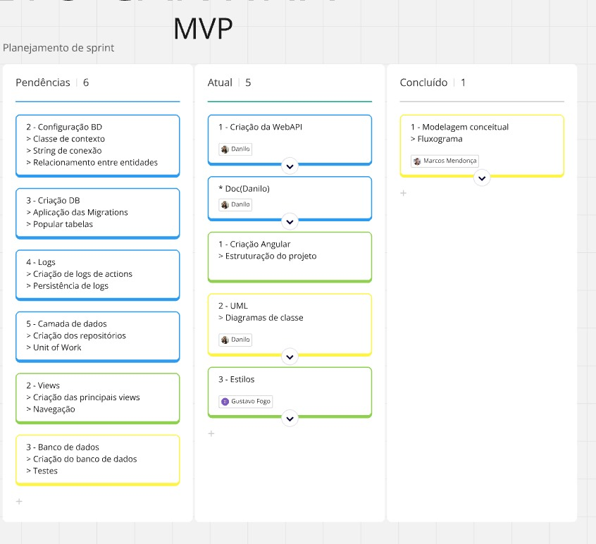
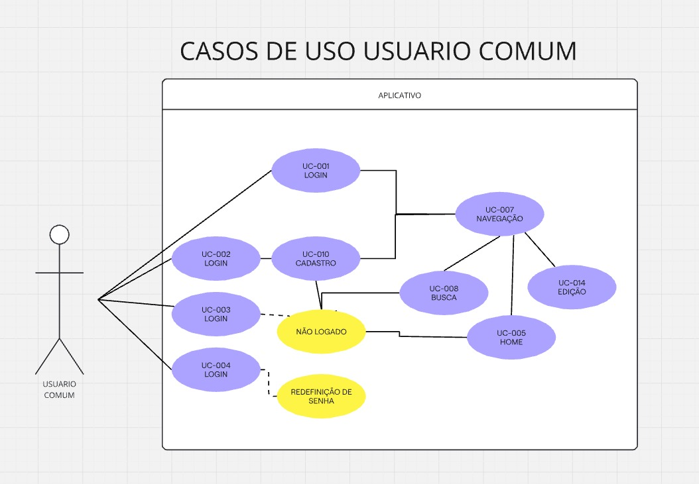

# PROJETO CANTINA

### EQUIPE

| NOME                  | FUNÇÃO                | RA           |
| --------------------- | ----------------------- | ------------ |
| PAULO                 | TECH LEADER/ ORIENTADOR | ------------ |
| DANILO HOLANDA ARAUJO | BACK-END                | 202202150241 |
| ------------          | DBA                     | ------------ |
| ------------          | REQUERIMENTS MANAGER    | ------------ |
| BEATRIZ               | FRONT-END               | 202202809225 |
| VITOR                 | FULL STACK              | ------------ |
| ------------          | ------------            | ------------ |

### ESTRUTURA DO CONTEUDO 🚧

| Documentações                          | Tópicos                                                                               | Descrição                                                                                                                                                                                                                       | Status |
| :--------------------------------------- | -------------------------------------------------------------------------------------- | --------------------------------------------------------------------------------------------------------------------------------------------------------------------------------------------------------------------------------- | ------ |
| **Documentação Inicial**         |                                                                                        |                                                                                                                                                                                                                                   | 📄     |
|                                          | [Problemática](#problemática)                                                           | A**problemática** descreve o contexto e os desafios que motivaram a criação do aplicativo. Aqui, deve-se detalhar quais são as dificuldades enfrentadas pelo público-alvo ou as limitações de soluções existentes. | ✔️   |
|                                          | [Proposta ](#proposta)                                                                    | Descreve como o  aplicativo aborda e resolve os problemas mencionados na problemática.                                                                                                                                          | ✔️   |
|                                          | [Tecnologias Utilizadas](#tecnologias-utilizadas)                                         | Uma tabela contendo todas as tecnologias utilizadas neste projeto (Linguagens de programação, Frameworks, Recursos externos, Softwares e etc).                                                                                  | 🚧     |
|                                          | [Termos Técnicos](#termos-técnicos)                                                     | Palavras e expressões técnicas relacionadas a área de TI.                                                                                                                                                                      | 🚧     |
|                                          | [Abreviações](#abreviações)                                                           | Siglas e abreviações contidas no projeto                                                                                                                                                                                        | 🚧     |
| **Documentação de Requisitos**   |                                                                                        |                                                                                                                                                                                                                                   | 📄     |
|                                          | [Visão Geral do Produto](#visão-geral-do-produto)                                       | Uma introdução/contextualização inicial sobre o projeto.                                                                                                                                                                      | ✔️   |
|                                          | [Stakeholders](#stakeholders)                                                             | Indivíduos, grupos ou organizações que podem estar interessados ou serem impactados pelo projeto.                                                                                                                              | ✔️   |
|                                          | [Requisitos](#requisito)                                                                  | Especificações funcionais e não funcionais que descrevem o que um sistema deve fazer ou as qualidades que ele deve ter.                                                                                                        | ✔️   |
|                                          | [Casos de Uso](#casos-de-uso)                                                             | Descrições de interações possíveis entre um sistema e seus usuários para alcançar um objetivo específico.                                                                                                                 | ✔️   |
|                                          | [Diagramas de Casos de Uso](#diagramas-de-casos-de-uso-🚧)                                | Representam visualmente as interações entre os usuários e um sistema, mostrando os casos de uso e seus relacionamentos.                                                                                                        | 🚧     |
| **Documentação de Arquitetura**  |                                                                                        |                                                                                                                                                                                                                                   | 📄     |
|                                          | [Visão geral da arquitetura do sistema](#visão-geral-da-arquitetura-do-sistema)         | Introdução e definições sobre arquitetura do sistema.                                                                                                                                                                         | ✔️   |
|                                          | [Diagramas de arquitetura](#diagramas-de-arquitetura)                                     | Representam visualmente a estrutura e o comportamento de um sistema, incluindo seus componentes, relacionamentos e interações.                                                                                                  | ✔️   |
|                                          | [Principais Componentes](#principais-componentes)                                         | Os principais componentes e diretórios do projeto.                                                                                                                                                                               | 🚧     |
|                                          | [Decisões Arquiteturais e Justificativas](#decisões-arquiteturais-e-justificativas)     | Arquitetura escolhida e os motivos pelo qual a escolhemos.                                                                                                                                                                        | ✔️   |
| **Documentação de Design**       |                                                                                        |                                                                                                                                                                                                                                   | 📄     |
|                                          | [Diagramas](#diagramas)                                                                   | Diagramas em geral: Classes, Fluxograma, Entidade e Relacionamento, etc.                                                                                                                                                          | 🚧     |
|                                          | [Especificações Detalhadas de Componentes](#especificações-detalhadas-de-componentes) | Lista de todos os componentes, bibliotecas, pacotes e suas funções.                                                                                                                                                             | 🚧     |
|                                          | [Design de Interfaces de Usuário](#design-de-interfaces-de-usuário-🚧)                  | Telas de interface visual.                                                                                                                                                                                                        | 🚧     |
|                                          | [Padrões de Design Utilizados](#padrões-de-design-utilizados)                           | Padrão de projeto utilizado.                                                                                                                                                                                                     | ✔️   |
| **Documentação de Testes**       |                                                                                        |                                                                                                                                                                                                                                   | 📄     |
|                                          | Plano de Testes                                                                        |                                                                                                                                                                                                                                   | 💤     |
|                                          | Relatórios                                                                            |                                                                                                                                                                                                                                   | 💤     |
|                                          | Histórico de erros                                                                    |                                                                                                                                                                                                                                   | 💤     |
| **Documentação de Código**      |                                                                                        |                                                                                                                                                                                                                                   | 📄     |
|                                          | [Comentários no Código Fonte](#comentários-no-código-fonte)                           |                                                                                                                                                                                                                                   | 🚧     |
|                                          | [Dicionário de Dados](#dicionario-de-dados)                                              |                                                                                                                                                                                                                                   | 🚧     |
|                                          | ~~Documentação de API~~                                                             |                                                                                                                                                                                                                                   | ❌     |
|                                          | Guia de Contribuição                                                                 |                                                                                                                                                                                                                                   | 💤     |
| **Documentação do Usuário**     |                                                                                        |                                                                                                                                                                                                                                   | 📄     |
|                                          | Guia ou Manual do Usuário                                                             |                                                                                                                                                                                                                                   | 💤     |
|                                          | Instruções do Software                                                               |                                                                                                                                                                                                                                   | 💤     |
|                                          | FAQs                                                                                   |                                                                                                                                                                                                                                   | 💤     |
| **Documentação de Manutenção** |                                                                                        |                                                                                                                                                                                                                                   | 📄     |
|                                          | Instruções de Instalação                                                           |                                                                                                                                                                                                                                   | 💤     |
|                                          | Soluções de Problemas                                                                |                                                                                                                                                                                                                                   | 💤     |
|                                          | Histórico de Versões                                                                 |                                                                                                                                                                                                                                   | 💤     |

| Simbolo | Descrição             |
| ------- | ----------------------- |
| ✔️    | Concluído              |
| 🚧      | Em andamento            |
| 💤      | Não iniciado           |
| ❌      | Anulado                 |
| 📄      | Título da documentaão |

---

> ### Documentação Inicial

---

#### Problemática

Atualmente, muitas cantinas enfrentam desafios na gestão de recursos e no controle de fluxos de transações. Processos manuais ou desorganizados podem resultar em:

* **Erros no controle de estoque** , o que leva à falta de produtos ou desperdício.
* **Dificuldade em gerenciar pagamentos e vendas** , impactando o fluxo de caixa e causando perda de tempo na conferência de transações.
* **Falta de integração entre diferentes áreas da cantina** , como a administração, funcionários e fornecedores, resultando em atrasos e ineficiências.
* **Problemas no atendimento ao cliente** , devido à demora nas transações e à falta de controle sobre pedidos.

Esses problemas comprometem a operação da cantina, causando insatisfação tanto para os gestores quanto para os clientes.

#### Proposta

O aplicativo proposto tem como objetivo solucionar os problemas de gestão de recursos e transações na cantina por meio de uma plataforma intuitiva e integrada. Ele oferece:

* **Controle de estoque automatizado** , permitindo que os gestores acompanhem em tempo real a quantidade de produtos disponíveis e evitem desperdícios ou faltas.
* **Gerenciamento de transações simplificado** , registrando automaticamente vendas e pagamentos, facilitando o fluxo de caixa e reduzindo erros humanos.
* **Integração entre diferentes áreas da cantina** , centralizando informações de fornecedores, estoque, funcionários e finanças em um único sistema.
* **Melhoria no atendimento ao cliente** , proporcionando um processo de compra mais rápido e eficiente.

Essa solução garante maior organização, economia de tempo, redução de erros e uma experiência mais agradável tanto para os funcionários quanto para os clientes da cantina.

#### Tecnologias Utilizadas 🚧

Aqui estão as descrições sugeridas para cada item da tabela:

| **Tecnologia**         | **Tipo**                               | **Descrição**                                                                                                                                    |
| ---------------------------- | -------------------------------------------- | -------------------------------------------------------------------------------------------------------------------------------------------------------- |
| **Javascript**         | Linguagem de Programação                   | Linguagem amplamente utilizada para desenvolvimento web, tanto no front-end quanto no back-end.                                                          |
| **C#**                 | Linguagem de Programação                   | Linguagem de programação orientada a objetos, desenvolvida pela Microsoft, usada principalmente para desenvolvimento em .NET.                          |
| **.Net**               | Framework de C#                              | Plataforma de desenvolvimento da Microsoft que permite criar aplicações para web, desktop e dispositivos móveis.                                      |
| **Typescript**         | Superset de Javascript                       | Extensão do Javascript que adiciona tipagem estática opcional e outros recursos avançados.                                                            |
| **MySQL**              | Sistema de Gerenciamento de Banco de Dados   | SGBD relacional de código aberto, amplamente utilizado para armazenar e gerenciar dados estruturados.                                                   |
| **Visual Studio**      | IDE                                          | Ambiente de desenvolvimento integrado (IDE) da Microsoft, com suporte a várias linguagens de programação, incluindo C# e .NET.                        |
| **Visual Studio Code** | Editor de Código                            | Editor de código-fonte leve e poderoso, desenvolvido pela Microsoft, com suporte a várias linguagens e ferramentas de desenvolvimento.                 |
| **Angular**            | Framework front-end                          | Framework de desenvolvimento front-end mantido pelo Google, utilizado para construir aplicações web dinâmicas de página única (SPA).                |
| **BR Modelo**          | Ferramenta de Modelagem de Sistemas          | Ferramenta utilizada para modelagem de sistemas, permitindo a criação de diagramas e representação visual de processos.                              |
| **Git**                | Ferramenta de Gerenciamento de Repositórios | Sistema de controle de versões distribuído, amplamente utilizado para rastrear mudanças no código e facilitar a colaboração entre desenvolvedores. |
| **Github**             | Repositório Web                             | Plataforma de hospedagem de código-fonte baseada em Git, que facilita o versionamento e a colaboração em projetos de software.                        |
| **HTML5**              | Linguagem de Marcação de Texto             | Versão mais recente do HTML, usada para estruturar e apresentar conteúdo na web.                                                                       |
| **CSS3**               | Linguagem de Estilização                   | Linguagem utilizada para estilizar e formatar o layout de páginas web, oferecendo maior controle sobre a aparência visual do conteúdo.                |
| **Miro**               | Ferramenta de Colaboração Visual           | Plataforma online para colaboração em equipe, usada para brainstorming, criação de diagramas e mapeamento de processos de forma visual e interativa. |

#### Termos Técnicos 🚧

Aqui estão as descrições sugeridas para os termos técnicos:

| **NOME**                | **DESCRIÇÃO**                                                                                                                    |
| ----------------------------- | ---------------------------------------------------------------------------------------------------------------------------------------- |
| **SQL**                 | Linguagem de consulta estruturada usada para gerenciar e manipular bancos de dados relacionais.                                          |
| **Back-End**            | Parte de uma aplicação que roda no servidor e é responsável pelo processamento de dados e lógica de negócios.                      |
| **Front-End**           | Parte de uma aplicação com a qual os usuários interagem diretamente, geralmente representada pela interface gráfica.                 |
| **Github**              | Plataforma de hospedagem de código-fonte que utiliza Git para controle de versão e colaboração em projetos.                          |
| **Stakeholder**         | Pessoas ou grupos interessados ou impactados pelo sucesso de um projeto, como clientes, usuários ou patrocinadores.                     |
| **Requisitos**          | Especificações ou condições que o sistema ou software deve atender para satisfazer as necessidades dos stakeholders.                 |
| **Bibliotecas**         | Conjunto de funções e recursos pré-escritos que podem ser reutilizados em programas, facilitando o desenvolvimento.                   |
| **Pacotes**             | Conjuntos de bibliotecas ou módulos organizados que fornecem funcionalidades específicas para um projeto.                              |
| **Frameworks**          | Estruturas de software que fornecem uma base genérica para o desenvolvimento de aplicações, permitindo a reutilização de código.   |
| **Requests**            | Requisições feitas por um cliente (como um navegador) para obter dados ou realizar uma ação em um servidor.                          |
| **Responses**           | Respostas enviadas por um servidor em resposta a uma request, contendo dados ou confirmações de ações.                               |
| **API**                 | Interface de Programação de Aplicações; conjunto de definições e protocolos que permite a comunicação entre diferentes sistemas. |
| **Camadas**             | Diferentes níveis de abstração em um sistema de software, como a camada de apresentação, de negócios e de dados.                   |
| **Entidades / Classes** | Estruturas que representam objetos do mundo real ou conceitos, contendo atributos e comportamentos dentro de um sistema.                 |
| **Atributos / Campos**  | Propriedades ou características de uma entidade ou classe que armazenam valores relevantes a essa entidade.                             |

#### Abreviações 🚧

| NOME | DESCRIÇÃO                                        |
| ---- | -------------------------------------------------- |
| RF   | REQUISITO FUNCIONAL                                |
| FRN  | REQUISITO NÃO FUNCIONAL                           |
| RS   | REQUISITO SUPLEMENTAR                              |
| RNE  | REGRA DE NEGÓCIO                                  |
| UC   | USE CASE (CASO DE USO)                             |
| MVC  | PADRÃO MODEL-VIEW-CONTROLLER                      |
| POO  | PARADIGMA DE PROGRAMAÇÃO ORIENTADA A OBJETOS     |
| POC  | PARADIGMA DE PROGRAMAÇÃO ORIENTADA A COMPONENTES |

---

> ### Documentação de Requisitos

---

#### Visão Geral do Produto

Este projeto foi desenvolvido utilizando a linguagem de programação C# e a plataforma .NET para criar um backend robusto e seguro, adequado para a gestão de recursos de uma cantina. O frontend é desenvolvido em Angular, permitindo a construção de uma interface de usuário dinâmica e responsiva para a web. O desenvolvimento é feito utilizando o Visual Studio Code e Visual Studio, proporcionando um ambiente de desenvolvimento integrado (IDE) eficiente para programação em C# e Angular.

Para o armazenamento e gerenciamento dos dados, utiliza-se o banco de dados MySQL, que é adequado para a manutenção de informações de estoque, transações e usuários de forma segura e eficiente. O controle de versão do código é realizado com Git, e os repositórios são hospedados no GitHub, garantindo a colaboração entre desenvolvedores e o versionamento do projeto. Além disso, a ferramenta Miro é utilizada para a criação de diagramas e fluxos, facilitando a visualização dos processos de desenvolvimento e arquitetura do sistema.

<figure align="center">
  

      
        <figcaption> Quadro referente as tarefas da equipe de desenvolvimento.
        </figcaption>
  

</figure>

#### Stakeholders

O projeto envolve os seguintes stakeholders:

1. **Administrador**: Responsável pela gestão geral da cantina, incluindo o controle de estoque, cadastro de produtos, e monitoramento das transações. O administrador possui acesso privilegiado para editar informações dos colaboradores e visualizar relatórios financeiros e de vendas, garantindo a operação eficiente da cantina.
2. **Colaborador**: Funciona como operador de caixa ou atendente na cantina. Este usuário registra as vendas e processa os pagamentos dos clientes, utilizando o sistema para realizar os lançamentos de transações de forma rápida e precisa, além de poder verificar o estoque dos produtos para informar clientes sobre a disponibilidade.
3. **Usuário Comum**: Cliente da cantina que utiliza o aplicativo para realizar pedidos e verificar informações como o cardápio e preços dos produtos disponíveis. Os usuários comuns não têm acesso aos relatórios ou controle de estoque, mas podem usufruir de uma experiência de compra mais ágil e organizada.
4. **Professor Orientador**: Atua como mentor do projeto, fornecendo orientações e feedback sobre o desenvolvimento da solução. Ajuda a garantir que os requisitos sejam atendidos e que o sistema desenvolvido esteja de acordo com as necessidades dos administradores e colaboradores.

#### **Requisitos**

* **Funcionais**: Descrevem as funcionalidades do sistema.

| TIPO | ID  | DESCRIÇÃO                                                                                                                                                    |
| ---- | --- | -------------------------------------------------------------------------------------------------------------------------------------------------------------- |
| RF   | 001 | O SISTEMA DEVE POSSUIR A FUNÇÃO DE LOGIN UNICO PARA TODOS OS NÍVEIS DE USUÁRIO.                                                                            |
| RF   | 002 | O SISTEMA DEVE PERMITIR A NAVEGAÇÃO INICIAL ENTRE AS QUATRO TELAS BÁSICAS INICIAIS, INDEPENDENTEMENTE DO LOGIN.                                             |
| RF   | 003 | O SISTEMA DEVE POSSUIR A FUNÇÃO DE CADASTRO DE USUÁRIO ONDE FAÇA A DISTINÇÃO ENTRE USUÁRIO COMUM E COLABORADOR.                                         |
| RF   | 004 | O SISTEMA DEVE POSSUIR A FUNÇÃO DE CADASTRO DE COLABORADORES RESTRITA A USUÁRIOS ADSMINISTRADORES.                                                          |
| RF   | 005 | O USUÁRIO COMUM LOGADO PODERÁ CONSULTAR OS PRODUTOS DISPONÍVEIS CADASTRADOS EM ESTOQUE COM INFORMAÇÕES COMO DE UM CARDÁPIO.                              |
| RF   | 006 | DEVE HAVER A FUNÇÃO DE LIMITE MÍNIMO DISPONÍVEL DE ITEMS EM ESTOQUE ONDE ALERTE USUARIOS COLABORADORES E ADMINISTRADORES QUE AQUELE PRODUTO ESTÁ ESCASSO. |
| RF   | 007 | USUARIOS COLABORADORE E ADMINISTRADORES DEVEM POSSUIR A FUNÇÃO DE ATUALIZAR O ESTOQUE DE ITEMS JÁ CADASTRADOS.                                              |
| RF   | 008 | USUARIOS ADMINISTRADORES PODERÃO ADICIONAR NOVOS PRODUTOS E CATEGORIAS AO ESTOQUE.                                                                            |

- **Não Funcionais**: Restrições, limites e especificações que o sistema deve possuir.

| TIPO | SUBTIPO     | ID  | DESCRIÇÃO                                                                        |
| ---- | ----------- | --- | ---------------------------------------------------------------------------------- |
| RNF  | SOFTWARE    | 001 | O SISTEMA DEVE PODER SER EXECUTADO EM ANDROID, IOS E WEB.                          |
| RNF  | DESEMPENHO  | 002 | O SISTEMA ARMAZENARÁ SEUS DADOS EM UM BANCO DO ESTILO RELACIONAL PELO SGBD MySQL. |
| RNF  | DESIGN      | 003 | O SISTEMA UTILIZARÁ MODELO DE DESIGN SEGUINDO PADRÃO MVC.                        |
| RNF  | SOFTWARE    | 004 | O SISTEMA SERÁ PRODUZIDO UTILIZANDO PARADIGMAS COMO POO , POC E ETC.              |
| RNF  | ARQUITETURA | 005 | O SISTEMA DEVERÁ SER CONSTRUIDO UTILIZANDO UMA ARQUITETURA DE MICROSERVIÇOS.     |

- **Suplementares**: Restrições e limites aplicados a todo o sistema.

| TIPO | ID  | DESCRIÇÃO                                                                                                                                             |
| ---- | --- | ------------------------------------------------------------------------------------------------------------------------------------------------------- |
| RS   | 001 | EM TODAS AS TELAS DO SISTEMA, DEVE EXISTIR O LOGO DO ESTABELECIMENTO E NOME DA APLICAÇÃO, EM QUE QUANDO PRESSIONADOS, LEVEM O USUARIO A TELA INICIAL. |

- **Regra de Negócio**: São premissas e/ou restrições aplicadas a uma operação comercial de uma empresa por exemplo.

| TIPO | ID  | DESCRIÇÃO                                                                                                                 |
| ---- | --- | --------------------------------------------------------------------------------------------------------------------------- |
| RNE  | 001 | APENAS O USUÁRIO ADMINISTRADOR DEVE PODER CADASTRAR  NOVOS COLABORADORES, NOVOS TIPOS DE PRODUTOS E NOVAS CATEGORIAS.     |
| RNE  | 002 | APENAS OS USUÁRIOS COLABORADORES E ADMINISTRADORES  PODERÃO CADASTRAR ATUALIZAR OS ESTOQUES COM A QUANTIDADE DE PRODUTOS. |
| RNE  | 003 | APENAS O USUÁRIO COMUM PODERÃO CADASTRAR CONTAS.                                                                          |
| RNE  | 004 | SÓ PODERÁ COMPRAR PRODUTOS OS USUÁRIOS COMUNS.                                                                           |
| RNE  | 005 | APENAS O PRÓPRIO USUÁRIO E ADMINISTRADORES TERÃO ACESSO AOS DADOS CRIPTOGRAFADOS.                                        |

#### Casos de Uso

Os diagramas de caso de uso descrevem funções de alto nível e escopo de um sistema. Esses diagramas também identificam as interações entre o sistema e seus agentes. Os casos de uso e os agentes nos diagramas de caso de uso descrevem o que o sistema faz e como os agentes o usam, mas não como o sistema opera internamente.

| Nome                               | Descrição                                                                                                                                                                          |
| :--------------------------------- | ------------------------------------------------------------------------------------------------------------------------------------------------------------------------------------ |
| Ator                               | São todos que interagem de alguma forma com o sistema a ponto de suas ações gerarem algum evento. Podem ser os stakeholders, hardware ou até mesmo outro sistema.                |
| Casos de Uso                       | É uma funcionalidade presente no sistema.                                                                                                                                           |
| Cenários                          | A forma em que uma funcionalidade é executada. um evento ocorrido dentro do sistema causado direta ou indiretamente pelos atores.                                                   |
| Associações                      | São relacionamentos entre: Atores**x** Casos de Uso e Casos de Uso **x** Casos de Uso.                                                                                  |
| Especialização / Generalização | Representam herança em paradigma orientado a objeto. serve para identificar características em comum entre atores ou casos de uso. Reutilização de características e funções. |
| Inclusão                          | Quando uma funcionalidade pode ser utilizada por mais de um caso de uso.                                                                                                             |
| Extensão                          | Casos de uso específicos, normalmente geradas por opções em condicionais, switch-case ou excessões.                                                                              |

- **Atores**:

**Usuário, Comum, Colaborador e Administrador.**

1. **Comum** é o usuário consumidor que possui restrições de acesso apenas as funções de consulta, seleção e compras de produtos, além de consulta, edição e remoção de dados pessoais.
2. **Colaborador** possui dados de identificação e funções específicas de operação na cantina como registro de transações e atualização de estoque;
3. **Administrador** possui privilégios adicionais em relação ao Colaborador, como gerenciar o estoque e visualizar relatórios de vendas e finanças. É um tipo de Usuário com atributos próprios, mas não se enquadra como Colaborador

* **Paradigma Orientado a Objetos**

O paradigma orientado a objetos (POO) é um modelo de programação que organiza o software em unidades chamadas objetos. Cada objeto representa uma instância de uma classe, que define um tipo específico de objeto. As classes podem ter atributos (dados) e métodos (funções) que operam nesses dados. O POO baseia-se em quatro princípios fundamentais:

| Princípio     | Conceito                                                                                                                                                              |
| -------------- | --------------------------------------------------------------------------------------------------------------------------------------------------------------------- |
| Abstração    | Foco nos aspectos essenciais de um objeto, ignorando detalhes irrelevantes para o contexto.                                                                           |
| Encapsulamento | Ocultação dos detalhes de implementação de um objeto, permitindo que apenas métodos autorizados acessem e modifiquem seus dados internos.                        |
| Herança       | Capacidade de uma classe herdar atributos e métodos de outra classe, permitindo a reutilização de código e a criação de hierarquias de classes.                 |
| Polimorfismo   | Capacidade de um objeto se comportar de diferentes maneiras, dependendo do contexto. Isso permite que objetos de classes diferentes sejam tratados de forma uniforme. |

- **Casos de Uso**:

| Ação                                         | Descrição                                                      | Atores                                        |
| ---------------------------------------------- | ---------------------------------------------------------------- | --------------------------------------------- |
| Login()                                        | Ação de autenticação do usuário do sistema                  | Todos os atores                               |
| Cadastro()                                     | Cadastro de dados pessoais                                       | Usuários comuns                              |
| Cadastro colaborador()                         | Cadastra um novo colaborador                                     | Usuários administradores                     |
| Exibir perfil()                                | Exibição de dados do perfil                                    | Todos os atores                               |
| Alterar dados cadastrais()                     | Alteração de dados cadastrais                                  | Usuários comuns e colaboradores              |
| Excluir conta()                                | Exclusão de conta                                               | Todos os atores exceto Usuário Administrador |
| Cadastrar produto() Cadastrar categoria() | Cadastro de novos produtos e categorias                          | Usuários administradores                     |
| Excluir produto() Excluir categoria()     | Cancelamento de candidatura em vaga                              | Usuários administradores                     |
| Editar produto() Editar categoria()       | Exibição de lista de vagas cadastradas e status da candidatura | Usuários administradores                     |
| Exibir produtos() Exibir categorias()     | Cadastro de vagas no sistema                                     | Usuários administradores                     |
| Exibir estoque()                               | Edição de vagas cadastradas                                    | Usuários administradores                     |
| Editar estoque()                               | Remoção de vagas cadastradas                                   | Usuários administradores                     |
| Adicionar item()                               | Adicionar item ao carrinho de compras                            | Usuário comum                                |
| Remover item()                                 | Remove item do carrinho de compras                               | Usuário comum                                |
| Confirmar compra()                             | Comfirma compra                                                  | Usuário comum                                |

- **Cenários**:

| TIPO | ID  | NOME        | DESCRIÇÃO                                                                                                                                                                                                  |
| ---- | :-- | ----------- | ------------------------------------------------------------------------------------------------------------------------------------------------------------------------------------------------------------ |
| UC   | 001 | LOGIN       | NESTE CENÁRIO O USUÁRIO COMUM CONSEGUE LOGAR NORMALMENTE, É AUTENTICADO E TEM ACESSO AOS DEMAIS RECURSOS DO APLICATIVO DE ACORDO COM O SEU NÍVEL DE AUTORIZAÇÃO.                                       |
| UC   | 002 | LOGIN       | AO ERRAR A SENHA OU TENTAR ACESSAR SEM TER UMA CONTA AUTENTICADA. O USUÁRIO É IMPEDIDO DE ACESSAR AS FUNCIONALIDADES DO SISTEMA COM UMA MENSAGEM SUGERINDO QUE ENTRE COM UMA CONTA VÁLIDA OU CADASTRE-SE. |
| UC   | 003 | LOGIN       | O USUÁRIO NÃO POSSUI CONTA E ESCOLHE A OPÇÃO "CADASTRAR"                                                                                                                                                 |
| UC   | 004 | LOGIN       | O USUÁRIO ESQUECEU A SENHA E AO ESCOLHER A OPÇÃO "ESQUECEU SUA SENHA?". É DIRECIONADO A TRATATIVA DE RESET DE SENHA.                                                                                     |
| UC   | 005 | HOME        | AO ENTRAR NO APLICATIVO, O USUÁRIO PODERÁ. SE JÁ LOGADO, OBTER EM PRIMEIRO MOMENTO, UM PEQUENO HISTÓRICO DE PRODUTOS E SUGESTÕES BASEADAS EM SEU HISTÓRICO DE PESQUISA SE HOUVER.                      |
| UC   | 006 | HOME        | AINDA NA TELA INICIAL, O USUÁRIO TERÁ UMA IMAGEM-LINK QUE O GUIARÁ PARA O SITE/APLICATIVO ESTÁCIO.                                                                                                       |
| UC   | 007 | NAVEGAÇÃO | O USUÁRIO PODERÁ NAVEGAR ENTRE AS QUATRO TELAS BÁSICAS DO SISTEMA  A QUALQUER MOMENTO ATRAVÉS DA BARRA DE NAVEGAÇÃO.                                                                                   |
| UC   | 008 | BUSCA       | O USUÁRIO COMUM CADASTRADO PODERÁ BUSCAR, FILTRAR E SELECIONAR PRODUTOS DISPONÍVEIS NO SISTEMA.                                                                                                           |
| UC   | 009 | BUSCA       | O USUÁRIO AINDA NÃO CADASTRADO PODERÁ BUSCAR, FILTRAR, PORÉM AO TENTAR SELECIONAR UM PRODUTO, DEVERÁ SEGUIR PARA O CADASTRO.                                                                            |
| UC   | 010 | CADASTRO    | O USUARIO COMUM PODERÁ EFETUAR SEU CADASTRO COM DADOS PESSOAIS.                                                                                                                                             |
| UC   | 011 | CADASTRO    | O USUARIO ADMINISTRADOR CADASTRA NOVOS PRODUTOS E CATEGORIAS.                                                                                                                                                |
| UC   | 012 | EXIBIR      | OS DADOS DO USUÁRIO SERÃO CRIPTOGRAFADOS. PORTANTO, APENAS ALGUNS DADOS SERÃO EXIBIDOS (PÚBLICOS) PARA REFERÊNCIA.                                                                                      |
| UC   | 013 | EXIBIR      | APENAS O ADMINISTRADOR E O PRÓPRIO USUÁRIO CADASTRADO PODERÃO TER ACESSO AOS SEUS DADOS CRIPTOGRAFADOS.                                                                                                   |
| UC   | 014 | EDIÇÃO    | USUÁRIO COMUM E COLABORADOR EDITA SEUS DADOS.                                                                                                                                                               |
| UC   | 015 | EDIÇÃO    | ADMINISTRADOR EDITA O CADASTRO DE PRODUTOS E CATEGORIAS.                                                                                                                                                     |
| UC   | 016 | DELETE      | O USUÁRIO COMUM EXCLUI SUA CONTA.                                                                                                                                                                           |
| UC   | 017 | DELETE      | O USUÁRIO ADMINISTRADOR EXCLUI PRODUTOS E CATEGORIAS.                                                                                                                                                       |
| UC   | 018 | BLOQUEIA    | O USUÁRIO ADMINISTRADOR BLOQUEIA A CONTA DO USUÁRIO COMUM OU COLABORADOR.                                                                                                                                  |

#### Diagramas de casos de uso 🚧

O diagrama de casos de uso possui uma importância complementar, pois não cabe em todos os cenários propostos pela aplicação e nos que cabe, filtra-se apenas aqueles em que realmente possa auxiliar no entendimento do processo.

<figure align="center">
  

      
        <figcaption> O diagrama acima demonstra uma visão geral cos casos de uso de usuário comum a um nível superficial.
        </figcaption>
  

</figure>

* **Paradigma Orientado a Componentes:**

O paradigma orientado a componentes (POC) é um modelo de desenvolvimento de software que se concentra na construção de sistemas a partir de componentes reutilizáveis e independentes. Os componentes são unidades de software que encapsulam funcionalidades específicas e podem ser compostos para formar sistemas mais complexos. As principais características do POC incluem:

- Reutilização
- Encapsulamento
- Composição
- Integração

Embora o POO e o POC tenham abordagens diferentes, ambos visam promover a reutilização, a modularidade e a manutenibilidade do software, cada um com suas próprias técnicas e princípios.

---

> ### Documentação de Arquitetura

---

#### Visão geral da arquitetura do sistema

...

#### Diagramas de arquitetura

1. ...

#### Principais Componentes

.

..

#### Decisões Arquiteturais e Justificativas

A escolha da arquitetura **monolítica** foi apropriada em várias sentidos, e que dependeu dos requisitos e das características do projeto. Algumas razões paraa escolhaarquitetura monolítica incluem:

1. **Simplicidade**: Uma arquitetura monolítica é mais simples de entender, desenvolver e manter em comparação com arquiteturas distribuídas ou baseadas em microserviços. Isso é vantajoso no caso de nossa equipe pequena e pouco experiente.
2. **Custo** : A construção e a manutenção de uma aplicação monolítica geralmente requerem menos infraestrutura e recursos em comparação com arquiteturas distribuídas, o que pode ser mais econômico para pequenas e médias empresas.
3. **Desenvolvimento rápido** : Uma arquitetura monolítica pode permitir um desenvolvimento mais rápido, pois os desenvolvedores podem se concentrar em uma única aplicação sem a complexidade adicional de gerenciar várias partes independentes.
4. **Facilidade de implantação** : Implantar uma aplicação monolítica é mais simples do que implantar uma aplicação distribuída, pois envolve apenas a implantação de um único artefato.
5. **Menos complexidade inicial** : Para projetos que não exigem escalabilidade imediata ou que têm requisitos de negócios relativamente simples, uma arquitetura monolítica pode ser uma escolha adequada devido à sua menor complexidade inicial.

---

> ### Documentação de Design

---

#### Diagramas

1. **Diagrama de Classes** 🚧

...

#### Especificações Detalhadas de Componentes

1. **Componentes Internos** 🚧

.

..

2. **Componentes Externos** 🚧

.

..

#### Design de Interfaces de Usuário 🚧

...

......

#### Padrões de design utilizados

...

---

> ### Documentação de Testes

---

Esta documentação será produzida durante a próxima fase do projeto onde testaremos a versão beta.

---

> ### Documentação de Código

---

#### Comentários no Código-Fonte

Esta documentação está em desenvolvimento com comentários nos próprios componentes do projeto e poderão ser conferidos em: [.](https://github.com/Daniloha/React-Native/tree/main/app-vagas)..

#### Dicionario de Dados

- ...

---

Esta documentação será desenvolvida durante a fase final do projeto.

---

> ### Documentação de Manutenção:

---

Esta documentação será desenvolvida durante a fase final do projeto.

---

🚧 🚧 🚧 🚧 🚧 🚧 🚧 🚧 🚧 🚧 🚧 🚧 🚧 🚧 🚧 🚧 🚧 🚧 🚧 🚧 🚧 🚧 🚧 🚧 🚧 🚧 🚧 🚧 🚧 🚧 🚧 🚧 🚧 🚧
